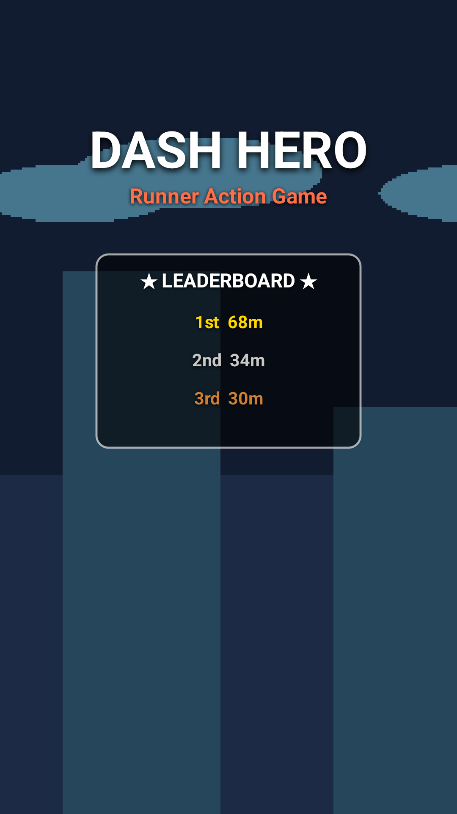
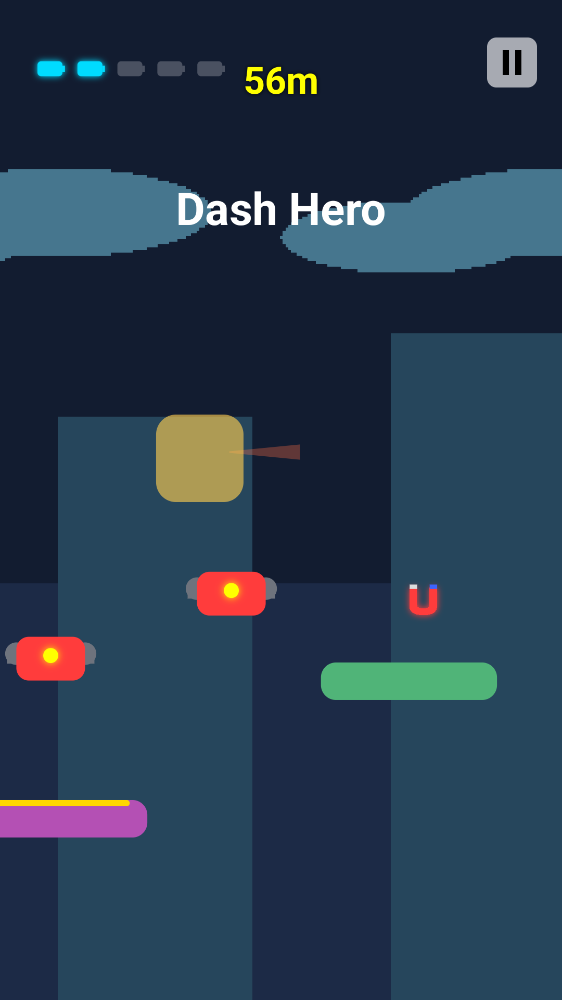
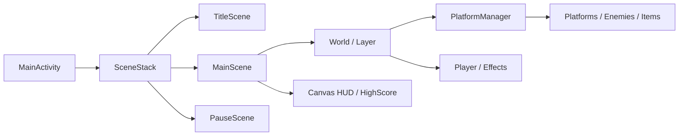

# Dash Hero

자동 점프와 터치 대시를 연결해 절차적으로 생성되는 발판을 돌파하는 Android 2D 러너 액션 게임입니다.

<p align="center">
  
  
</p>

<p align="center"><sub>Android 36.1 x86_64 에뮬레이터에서 Debug APK를 실행해 캡처한 화면입니다. (2026-08-08)</sub></p>

| 항목 | 내용 |
| --- | --- |
| 개발 기간 | 2026.04 ~ 2026.06 |
| 개발 형태 | 개인 프로젝트 |
| 플랫폼 | Android 7.0(API 24) 이상 |
| 언어 | Kotlin |
| 렌더링 | Android Canvas 기반 커스텀 2D 렌더링 |
| 프레임워크 | `SceneStack`, `World`, `SoundPool`, `MediaPlayer`, `SharedPreferences` |

## 구현 범위

`app`에는 Dash Hero의 게임 전용 로직을, `a2dg`에는 수업 과정에서 구축하고 확장한 Android 2D 게임 프레임워크를 구성했습니다.

- 자동 점프와 0.24초 터치 대시, 대시 잔상과 대시 중·종료 후 0.5초 무적
- 문자열 패턴 기반 무한 발판과 난이도 상승
- 일반 적·드론·가시 적과 충돌·밟기·넉백 판정
- 배터리 피버, 자석과 거대화 아이템
- 타이틀·플레이·일시정지 Scene 전환
- 기기별 Top 3 기록 저장
- BGM과 효과음 재생, Canvas HUD

## 게임 플레이

캐릭터는 발판에 착지할 때마다 자동으로 점프합니다. 화면을 터치하면 전방으로 대시하며 일반 적과 드론을 밀어내거나 위에서 밟아 통과할 수 있습니다. 가시와 `SpikyEnemy`는 일반 대시로 파괴할 수 없으며 거대화 또는 피버 상태에서만 제거됩니다.

배터리 5개를 모으면 5초 동안 피버가 발동해 무적·자동 스크롤·낙사 방지 효과를 얻습니다. 적이나 가시에 일반 상태로 부딪히거나 화면 아래로 추락하면 게임이 종료됩니다.

## 핵심 구현

### 대시와 월드 스크롤 분리

대시 중 플레이어가 화면 밖으로 벗어나거나 카메라가 갑자기 이동하지 않도록 플레이어 좌표와 월드 진행 거리를 분리했습니다.

- 플레이어가 화면 X=620px 지점을 넘어 이동한 거리를 `pendingScrollDistance`에 누적
- 누적 거리를 프레임 시간과 현재 난이도에 맞춰 월드에 단계적으로 적용
- 대시 종료 후 기준 위치로 복귀하는 거리를 월드 이동량으로 전환해 화면 미끄러짐 완화

### 프레임 간 위치를 이용한 충돌 판정

현재 AABB 겹침만 사용하지 않고 이전 프레임의 플레이어 하단·적 상단과 상대 Y 속도를 함께 비교해 밟기와 옆면 충돌을 구분했습니다. 발판 착지도 이전 위치와 다음 위치 사이에 발판 상단이 있는지 검사해 프레임 저하 시 통과하는 현상을 줄였습니다.

### 발판 생성과 객체 생명주기

`X`, `H`, `L`, `-` 문자로 구성한 패턴을 순회해 일반·고지대·저지대·낙사 구간을 생성합니다. 200m마다 최대 5단계까지 난이도를 높이고, 플레이어 근처의 갑작스러운 적 생성을 제한하며, 화면 밖 객체는 목록에서 제거합니다. 피버 중과 종료 후 2초 동안은 안전 패턴만 선택합니다.

움직이는 발판 위 객체는 생성 시 저장한 상대 오프셋을 부모 발판의 현재 좌표에 적용해 함께 이동시킵니다. 발판이 무너지면 참조를 해제해 각 객체가 독립적으로 갱신됩니다.

## 구조



- `SceneStack`이 타이틀, 플레이와 일시정지 오버레이를 분리합니다.
- `World`의 레이어 순서에 따라 배경·발판·이펙트·플레이어를 렌더링합니다.
- `PlatformManager`가 발판, 적, 장애물과 아이템의 생성·갱신·회수를 관리합니다.
- `SharedPreferences`에 Top 3 기록을 저장합니다.
- BGM은 `MediaPlayer`, 효과음은 `SoundPool`로 재생합니다.

## 빌드와 실행

Android Studio 또는 Android SDK, JDK 21과 Android SDK Platform 36.1 환경을 사용합니다.

```powershell
.\gradlew.bat assembleDebug
adb install -r app/build/outputs/apk/debug/app-debug.apk
adb shell am start -n com.example.dashhero/.MainActivity
```

Debug APK는 `app/build/outputs/apk/debug/app-debug.apk`에 생성됩니다. `assembleRelease`도 빌드할 수 있지만 현재 배포용 서명 설정은 없습니다.

## 빌드·실행 확인

2026-08-08 `assembleDebug`·`assembleRelease` 빌드와 Android 36.1 x86_64 에뮬레이터 설치·실행을 확인했습니다. `test`는 프로젝트 생성 시 포함된 산술 예제만 검사하므로 게임플레이를 검증한 것으로 간주하지 않았으며, 물리 기기와 장시간 실행은 확인하지 않았습니다.

## 개선 방향

게임 규칙 자동 테스트, 사운드 설정, 서명된 배포 빌드와 외부 이미지·음원 리소스의 권리 문서화를 보완할 예정입니다.

