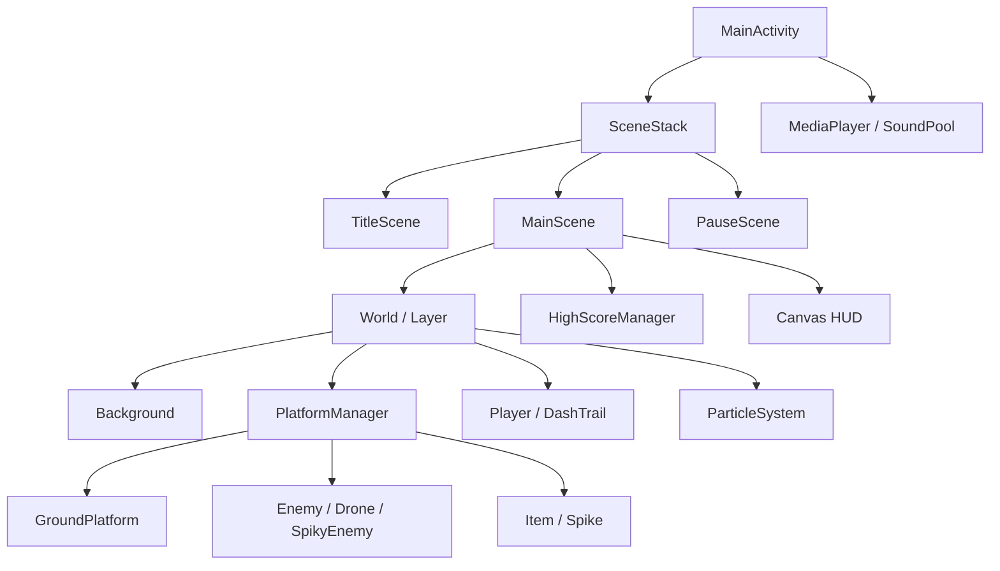

# Dash Hero

> 자동 점프와 터치 대시를 연결해 절차적으로 생성되는 발판을 돌파하는 Android 2D 러너 액션 게임

[최종 발표 영상](https://www.youtube.com/watch?v=97vl498Pt-w)

<p align="center">
  
  
</p>

<p align="center"><sub>Android 36.1 x86_64 에뮬레이터에서 직접 빌드한 Debug APK를 실행해 캡처한 화면입니다. (2026-08-08)</sub></p>

## 프로젝트 요약

| 항목 | 내용 |
| --- | --- |
| 개발 형태 | 개인 프로젝트 |
| 개발 기간 | 2026.04 ~ 2026.06 |
| 플랫폼 | Android 7.0(API 24) 이상 |
| 언어 | Kotlin |
| 렌더링 | Android Canvas 기반 커스텀 2D 렌더링 |
| 핵심 API | `SceneStack`, `World`, `SoundPool`, `MediaPlayer`, `SharedPreferences` |
| 현재 상태 | 수업 프로젝트 기능 구현 완료, 서명된 배포 APK·스토어 출시는 없음 |

`app`에는 Dash Hero의 플레이어, 월드 생성, 전투 판정, 아이템, UI와 사운드가 들어 있습니다. `a2dg`는 수업 과정에서 구축한 Android 2D 게임 프레임워크 모듈이며 Activity 생명주기, 게임 루프, 씬 스택, 월드 레이어와 공통 객체를 담당합니다.

README 정리 전 `main`의 89개 커밋은 모두 김도윤 계정으로 기록되어 있습니다. 포트폴리오에서는 게임 전용 로직을 직접 구현 범위로, `a2dg`는 수업 프레임워크를 적용·확장한 범위로 구분합니다.

## 게임 플레이

1. 타이틀 화면을 터치하면 게임이 시작됩니다.
2. 캐릭터는 발판에 착지할 때마다 자동으로 점프합니다.
3. 화면을 터치하면 0.24초 동안 전방으로 대시합니다. 대시가 끝나면 기준 위치로 보간 복귀합니다.
4. 일반 적과 드론은 대시로 밀어내거나 위에서 밟아 통과합니다.
5. 배터리 5개를 모으면 5초 동안 피버가 발동해 무적·자동 스크롤·낙사 방지 효과를 얻습니다.
6. 적이나 가시에 일반 상태로 부딪히거나 화면 아래로 추락하면 게임이 종료됩니다.

### 적과 아이템

| 요소 | 동작 |
| --- | --- |
| `Enemy` | 발판 위를 점프합니다. 대시·거대화로 처치하거나 머리를 밟아 반동 점프할 수 있습니다. |
| `DroneEnemy` | 공중을 주기 운동합니다. 대시·거대화로 처치하거나 머리를 밟을 수 있습니다. |
| `SpikyEnemy` | 밟아도 제거되지 않고 반동만 발생합니다. 일반 대시는 위험하며 거대화·피버 상태에서 파괴할 수 있습니다. |
| `Spike` | 일반 상태와 대시 중에는 피해야 합니다. 거대화·피버 상태에서는 파괴할 수 있습니다. |
| 배터리 | 점수 10m를 더하고 5개 수집 시 피버를 발동합니다. |
| 자석 | 6초 동안 반경 안의 아이템을 플레이어 쪽으로 이동시킵니다. |
| 별 | 5초 동안 캐릭터를 1.6배로 키우고 충돌 공격을 강화합니다. |

## 구현 구조



- `SceneStack`으로 타이틀, 플레이, 일시정지 오버레이를 분리했습니다.
- `World`의 레이어 순서로 배경 → 발판 → 대시 잔상 → 플레이어·파티클을 렌더링하고, `MainScene`이 HUD를 마지막에 직접 그립니다.
- `PlatformManager`가 발판, 적, 장애물, 아이템의 생성·갱신·회수를 한곳에서 관리합니다.
- `SharedPreferences`에 기기별 Top 3 기록을 저장합니다.
- BGM은 `MediaPlayer`, 점프·대시·밟기·수집·게임오버 5개 효과음은 `SoundPool`로 재생합니다.

## 핵심 구현과 문제 해결

### 1. 플레이어 대시와 월드 스크롤 분리

대시 중 플레이어를 계속 오른쪽으로 보내면 화면 밖으로 벗어나고, 곧바로 월드를 옮기면 카메라가 튀는 문제가 있었습니다.

- 플레이어는 화면 X=620px 지점, 시작 기준점보다 440px 앞까지 이동합니다.
- 스크롤 기준선을 넘은 거리만 `pendingScrollDistance`에 누적합니다.
- 누적 거리는 프레임 시간, 최소·최대 속도와 현재 난이도를 반영해 단계적으로 월드에 적용합니다.
- 대시 종료 후 플레이어가 기준 위치로 돌아오는 거리는 즉시 월드 이동량으로 바꿔 화면 미끄러짐을 줄였습니다.

이 방식으로 플레이어 좌표와 월드 진행 거리를 분리하면서도 한 번의 대시가 끊기지 않고 스크롤로 이어지도록 만들었습니다.

### 2. 프레임 간 위치를 이용한 충돌 판정

단순 AABB 겹침만으로는 적의 옆면을 머리 밟기로 잘못 판단하거나 프레임 드롭 때 발판을 통과할 수 있었습니다.

- 현재 프레임의 겹침과 이전 프레임의 플레이어 하단·적 상단을 함께 비교합니다.
- 플레이어와 적의 상대 Y 속도로 하강에 가까운 상태인지 확인한 뒤 밟기와 옆면 충돌을 분리합니다.
- 착지 시에는 이전 위치와 다음 위치 사이에 발판 상단이 있는지 검사합니다.
- 발판 가장자리에서는 플레이어 충돌 폭의 양쪽 25px를 제외한 내부 영역이 겹쳐야 발판으로 인정해 허공 착지를 줄였습니다.
- 대시 후 0.5초 무적과 기준점 복귀 상태를 별도로 두어 같은 적과 연속 충돌하는 문제를 완화했습니다.

### 3. 패턴 기반 무한 발판과 객체 생명주기

`X`, `H`, `L`, `-`로 구성된 문자열 프리셋을 순회하며 일반·고지대·저지대·낙사 구간을 생성합니다.

- 처음 6개 슬롯(인덱스 0~5)은 적과 장애물이 없는 안전 구간으로 유지합니다.
- 200m마다 난이도를 올리고 최대 5단계까지 대시 속도와 적·장애물 확률을 높입니다.
- 플레이어와 650px 이내인 위치에는 적·드론·가시가 갑자기 생성되지 않도록 제한합니다.
- 화면 왼쪽으로 완전히 벗어난 발판, 적, 아이템과 장애물을 목록에서 제거합니다.
- 피버 중에는 안전 패턴만 선택하고 종료 후에도 2초 동안 안전 패턴을 유지합니다.

### 4. 움직이는 발판의 상대 좌표 동기화

움직이는 발판만 갱신하면 위에 놓인 적·아이템·가시가 공중에 남는 문제가 있었습니다. 생성 시 부모 발판과의 상대 오프셋을 저장하고, 매 프레임 부모의 현재 좌표에 오프셋을 다시 적용해 함께 움직이도록 구성했습니다. 발판이 무너지면 참조를 해제해 각 객체가 독립적으로 갱신됩니다.

## 프로젝트 구조

```text
app/
└─ src/main/
   ├─ java/com/example/dashhero/
   │  ├─ MainActivity.kt
   │  └─ game/
   │     ├─ scene/       # TitleScene, MainScene, PauseScene
   │     ├─ objects/     # Player, PlatformManager, 적·아이템·이펙트
   │     ├─ sound/       # SoundPool 효과음
   │     └─ util/        # 로컬 Top 3 저장
   └─ res/               # 배경 이미지와 WAV 리소스
a2dg/
└─ src/main/java/...     # 게임 루프, SceneStack, World, 공통 객체
docs/images/             # 실제 실행 화면과 GitHub 활동 자료
```

## 빌드와 실행

### 요구 환경

- Android Studio 또는 Android SDK
- JDK 21 권장 — 실제 검증 환경
- Android SDK Platform 36.1
- Windows에서는 저장소의 Gradle Wrapper 사용

### 명령줄 빌드

```powershell
git clone https://github.com/douyun0623/2026-spgp-dash-hero.git
Set-Location 2026-spgp-dash-hero

.\gradlew.bat assembleDebug
.\gradlew.bat test
```

Debug APK는 `app/build/outputs/apk/debug/app-debug.apk`에 생성됩니다.

```powershell
adb install -r app/build/outputs/apk/debug/app-debug.apk
adb shell am start -n com.example.dashhero/.MainActivity
```

Release 변형도 `assembleRelease`로 빌드할 수 있지만 현재 저장소에는 배포용 서명 설정이 없습니다.

## 검증 결과

검증일: 2026-08-08

| 항목 | 결과 |
| --- | --- |
| `assembleDebug` | 성공, Debug APK 생성 |
| `assembleRelease` | 성공, lint vital 포함 |
| `test` | 2개 예제 단위 테스트 통과 |
| 설치·콜드 스타트 | Android 36.1 x86_64 에뮬레이터에서 성공 |
| 플레이 흐름 | 타이틀 → 게임 시작 → 대시·점수 증가 → 일시정지 → 타이틀 복귀 확인 |
| 런타임 안정성 | 검증 구간에서 프로세스 응답 유지, `AndroidRuntime` 예외 없음 |

단위 테스트 두 개는 Android 프로젝트 생성 시 포함된 산술 예제이므로 게임 규칙을 검증하지 않습니다. 물리 기기, 장시간 플레이, 서명 APK와 스토어 배포는 검증하지 않았습니다.

## 현재 한계

- 절차 생성이 비결정적 난수를 사용하므로 같은 플레이 상황을 재현하는 테스트가 어렵습니다.
- 특수 발판의 이동 범위와 다음 발판 위치가 드물게 겹칠 수 있습니다.
- 게임 플레이 로직에 대한 자동화 테스트가 없습니다.
- BGM·효과음 볼륨을 조절하거나 끄는 설정 화면이 없습니다.
- 서명된 APK, CI, GitHub Release가 없습니다.
- 저장소에 별도 `LICENSE`가 없고 배경·음원 리소스의 출처와 재사용 조건이 문서화되어 있지 않습니다. 외부 배포 전 권리 확인이 필요합니다.

## 발표 자료

- [3차 최종 발표](https://www.youtube.com/watch?v=97vl498Pt-w)
- [2차 발표](https://www.youtube.com/watch?v=qfScB1W2sp8)
- [1차 발표](https://youtu.be/XtZi-GZ4ehE)
